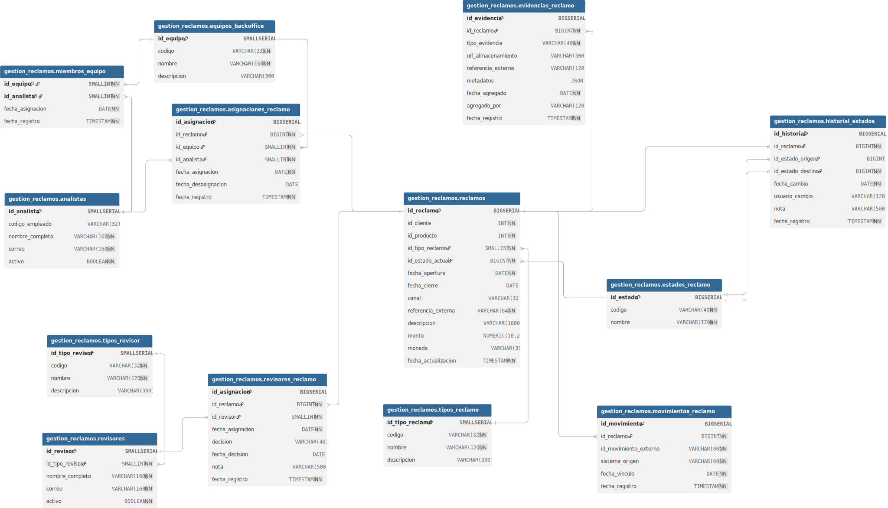

# 📑 Proyecto Cloud – Gestión de Reclamos

Este documento describe el proyecto **Gestión de Reclamos**, una solución cloud modular diseñada para cubrir el ciclo completo de atención de reclamos: desde el registro inicial hasta la resolución, incluyendo asignaciones, revisiones, evidencias, trazabilidad de estados y movimientos externos.

---

## 📌 Índice

1. [🔧 Arquitectura General](#-arquitectura-general)
2. [🧩 APIs del Proyecto](#-apis-del-proyecto)
3. [🖥️ Web Reclamos](#-web-reclamos)
4. [📝 Descripción General](#-descripción-general)
5. [🗂 Modelo Entidad-Relación (MER)](#-modelo-entidad-relación-mer)
6. [📊 Diccionario de Datos](#-diccionario-de-datos)
7. [🗄 Scripts SQL](#-scripts-sql)
8. [📌 Notas de Diseño](#-notas-de-diseño)
9. [👥 Autores](#-autores)

---

## 🔧 Arquitectura General

La solución se despliega sobre AWS Cloud, combinando componentes tradicionales y serverless para garantizar escalabilidad, seguridad y modularidad.

📌 Diagrama de arquitectura:


**Componentes destacados:**

- **Subred pública**: balanceador de carga + web on containers (tracking reclamos).
- **Subred privada**: balanceador interno + application servers + bases de datos PostgreSQL (RDS).
- **Serverless**: microservicios en Lambda y DynamoDB para APIs de Tarjetas y Movimientos.
- **Flujo completo**: desde usuarios externos hasta persistencia y lógica de negocio.

---

## 🧩 APIs del Proyecto

| API             | Repositorio | Endpoint | Catálogo |
|----------------|-------------|----------|----------|
| **Clientes**    | [Repo](https://github.com/Codenid/api-clientes-abc) | [Lookup](http://52.1.53.185:8000/api/clientes/lookup) | [Docs](http://52.1.53.185:8000/docs) |
| **Tarjetas**    | [Repo](https://github.com/Codenid/api-tarjetas-abc) | [Listar](https://ugl4isqmt3.execute-api.us-east-1.amazonaws.com/dev/tarjetas/listar) | [Docs](https://ugl4isqmt3.execute-api.us-east-1.amazonaws.com/dev/tarjetas/listar) |
| **Transacciones** | [Repo](https://github.com/Codenid/api-transacciones-abc) | [Transacciones](https://aln4z3dlj1.execute-api.us-east-1.amazonaws.com/transacciones/) | [Docs](https://aln4z3dlj1.execute-api.us-east-1.amazonaws.com/transacciones/) |
| **Reclamos**    | [Repo](https://github.com/Codenid/api-reclamos-abc) | [Home](http://13.222.79.184:8001/) | [Docs](http://13.222.79.184:8001/docs) |

📎 Subsecciones de la API de Reclamos:
- [Descripción general](#-descripción-general)
- [Modelo Entidad-Relación (MER)](#-modelo-entidad-relación-mer)
- [Scripts SQL](#-scripts-sql)
- [Notas de diseño](#-notas-de-diseño)

---

## 🖥️ Web Reclamos

- **Repositorio**: [web-reclamos-abc](https://github.com/Codenid/web-reclamos-abc)
- **Deploy**: [http://13.222.79.184:3000/](http://13.222.79.184:3000/)

---

## 📝 Descripción General

La base de datos está implementada en **PostgreSQL**, bajo el esquema `gestion_reclamos`.  
El modelo contempla:

- Reclamos como entidad central.
- Estados y trazabilidad histórica.
- Asignaciones a equipos y analistas.
- Revisión por tipos de revisores.
- Evidencias y movimientos externos.

---

## 🗂 Modelo Entidad-Relación (MER)

📌 Diagrama generado con [dbdiagram.io](https://dbdiagram.io/)  
📚 Documentación interactiva: [dbdocs.io](https://dbdocs.io/winstonflores30/Prj-Reclamos-Core)



---

## 📊 Diccionario de Datos

| Tabla | Descripción |
|-------|-------------|
| `tipos_reclamo` | Catálogo de tipos de reclamo. |
| `estados_reclamo` | Estados posibles de un reclamo. |
| `tipos_revisor` | Tipos de revisor (legal, riesgos, etc.). |
| `reclamos` | Entidad principal con vínculo a cliente, producto y estado. |
| `historial_estados` | Trazabilidad de cambios de estado. |
| `equipos_backoffice` | Equipos que gestionan reclamos. |
| `analistas` | Analistas asignados a equipos. |
| `miembros_equipo` | Relación N:M entre equipos y analistas. |
| `asignaciones_reclamo` | Asignaciones específicas por reclamo. |
| `revisores` | Personas que revisan reclamos. |
| `revisores_reclamo` | Relación con decisión y notas. |
| `evidencias_reclamo` | Archivos y metadatos asociados. |
| `movimientos_reclamo` | Eventos externos vinculados. |

---

## 🗄 Scripts SQL

### 📁 DDL – Definición de Esquema

Archivo: [`schema_ddl.sql`](./scripts/schema_ddl.sql)  
Incluye creación de esquema, tablas, claves primarias, foráneas e índices.

📌 Ejemplo:
```sql
CREATE SCHEMA IF NOT EXISTS gestion_reclamos;

CREATE TABLE IF NOT EXISTS gestion_reclamos.tipos_reclamo (
  id_tipo_reclamo SMALLSERIAL PRIMARY KEY,
  codigo VARCHAR(32) UNIQUE NOT NULL,
  nombre VARCHAR(120) NOT NULL,
  descripcion VARCHAR(300)
);
-- ...
```

---

### 📁 DML – Carga Inicial de Datos

Archivo: [`data_dml.sql`](./scripts/data_dml.sql)  
Contiene inserciones para catálogos base.

📌 Ejemplo:
```sql
INSERT INTO gestion_reclamos.tipos_reclamo (codigo, nombre, descripcion)
VALUES
  ('FRAUDE_TARJETA', 'Fraude en tarjeta', 'Transacciones no reconocidas.'),
  ('DOBLE_COBRO', 'Doble cobro', 'Duplicidad de cargos.')
-- ...
```

---

## 📌 Notas de Diseño

- Uso de claves primarias autoincrementales (`SMALLSERIAL`, `BIGSERIAL`) según cardinalidad.
- Índices compuestos y restricciones únicas para integridad referencial.
- Relaciones en cascada para historial, evidencias y asignaciones.
- Preparado para auditoría y trazabilidad completa.
- Modularidad pensada para onboarding técnico y escalabilidad.

---

## 👥 Autores

| Nombre | Rol | Perfil |
|--------|-----|--------|
| **Nicole Arenas L.** | Project Manager | [Narenas96](https://github.com/narenas96) |
| **Edgard Inga** | Project Manager | [DragdeFroylan](https://github.com/DragdeFroylan) |
| **Estuardo** | Project Manager | - |
| **Gianmarco** | Project Manager | - |
| **DM** | Project Manager | - |
| **Piero Palacios B.** | Project Manager & Frontend | [Pipaber](https://github.com/pipaber) |
| **Winston Flores** | Arquitecto de Soluciones | [Codenid](https://github.com/Codenid) |
---
